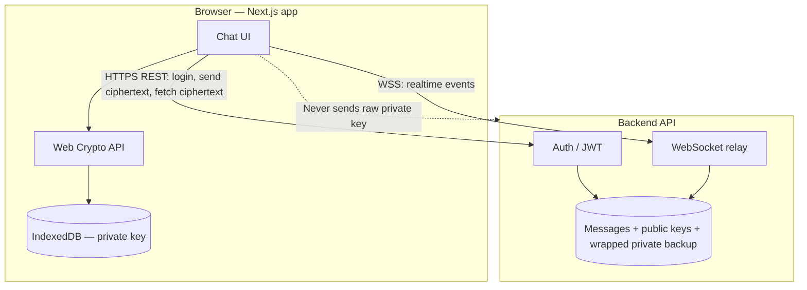

# MutterBox — End-to-end encrypted messaging

A **Next.js** chat client where the server only ever stores ciphertext. Plain English: it works like WhatsApp-style E2EE — messages are scrambled on your device before they leave, the API sees gibberish, and only the intended recipient can read them.

---


- **Messages are encrypted on the device** before they are sent.
- **The server only stores scrambled data** — it never sees readable message text.
- **Only the person you are chatting with** can decrypt what you sent (plus you, on your own devices, using your keys).
- **If someone compromised the server**, they would still not get usable message content from the ciphertext alone.

### Lock-and-key analogy

Every user has two keys:

| Key | Role |
|-----|------|
| **Public key** | Like a mailing address. You share it (via the server). Anyone can use it to encrypt data *for you*. |
| **Private key** | The only key that decrypts what was locked for you. It stays on the client; it is **not** sent to the server in raw form. |

**Alice → Bob in one sentence:** Alice fetches Bob’s public key, encrypts the message so only Bob’s private key can open it, the server stores the blob, Bob decrypts locally with his private key.

---

## Architecture

High-level split of responsibility between this frontend and the hosted API (e.g. `whisperbox.koyeb.app`).



**Frontend (this repo)**

- Generate the user’s RSA key pair in the browser.
- Keep the **private** key in **IndexedDB**; upload only the **public** key (and password-wrapped backup of the private key for re-login).
- Encrypt before `POST /messages`; decrypt after `GET .../messages`.
- Render conversations, search, WebSocket updates.

**Backend (provided API)**

- Store users, JWTs, **public keys**, and **wrapped** private key material (for restoring the key after login on a new browser).
- Store and relay **encrypted** message payloads only.
- Does **not** perform message decryption (no access to the user’s raw private key).

---

## Encryption: how it actually works

Two algorithms work together — this is standard **hybrid encryption**.

| Piece | Algorithm | Why |
|-------|-----------|-----|
| Key exchange / wrapping | **RSA-OAEP** (2048-bit, SHA-256) | Secure for small secrets; too slow for long messages. |
| Message body | **AES-GCM** | Fast, authenticated encryption for arbitrary-length text. |

### Per-message flow (step by step)

1. **Create a one-time symmetric key** (AES-GCM key) — the “session key” for this message.
2. **Encrypt the plaintext** with AES-GCM → `ciphertext` + message `iv`.
3. **Encrypt that session key** with the recipient’s **RSA public key** → `encryptedKey`.
4. **Encrypt the same session key** with the **sender’s RSA public key** as well → `encryptedKeyForSelf` (so the sender can read their own sent messages from the server later).
5. **Send** `{ ciphertext, iv, encryptedKey, encryptedKeyForSelf }` to the server.
6. **Recipient** uses their **RSA private key** to decrypt `encryptedKey`, then uses the recovered AES key to decrypt `ciphertext`.
7. **Sender reading history** uses `encryptedKeyForSelf` the same way.

Steps 1–4 happen in the client (`src/lib/crypto.ts`). The server stores the payload as opaque fields.

---

## Key management

### At registration

1. Generate an **RSA-OAEP** key pair in the browser.
2. Derive a **wrapping key** from the user’s password with **PBKDF2** (salt stored on the server).
3. **Wrap** (encrypt) the private RSA key with **AES-GCM** using that wrapping key → `wrapped_private_key` + `wrapped_private_key_iv`.
4. Send to the server: **public key**, wrapped private blob, salt, IV — **never** the raw private key.
5. Store the **unwrapped** private `CryptoKey` in **IndexedDB** for fast use while using the app.

### At login (new browser / cleared storage)

1. Authenticate; receive user record including wrapped key material.
2. Re-derive the wrapping key from the password + salt.
3. **Unwrap** the private key and write it back into IndexedDB.

If wrapping material is missing or the password is wrong, the client cannot reconstruct the private key and **historical messages cannot be decrypted** on that device.

### Storage locations (conceptual)

| Data | Where |
|------|--------|
| Raw private key | **IndexedDB only** (this app’s store) |
| Public key | Server |
| Wrapped private key + PBKDF2 salt + wrap IV | Server (for login restore) |
| Message ciphertext + encrypted session keys | Server |

---

## Security trade-offs

**Strengths**

- **True E2EE for message content:** the API does not need — and does not receive — the user’s raw private key.
- **Industry-standard building blocks:** RSA-OAEP + AES-GCM + PBKDF2 via Web Crypto.
- **Hybrid encryption** matches common real-world designs (scaled-down cousin to Signal/WhatsApp-style stacks).

**Trade-offs and trust assumptions**

- **Password strength** directly affects protection of the **wrapped** private key on the server. A weak password makes offline guessing of the wrap easier.
- **The server is trusted for identity and delivery:** it can swap public keys or metadata if compromised (classic **key distribution** risk). This app does not implement independent key verification (e.g. safety numbers / out-of-band checks).
- **Web app model:** anyone who controls the **origin** (hosting, CDN, build pipeline) could theoretically serve malicious JavaScript. Native apps and reproducible builds reduce that class of risk; browsers always trust the served bundle.
- **Device compromise:** malware on the device can read IndexedDB and memory; E2EE does not protect against a fully compromised client.

---

## Known limitations

- **Web Crypto** requires a **secure context** (HTTPS, or `localhost` for development).
- **Private key loss:** clearing site data without a successful **password-based unwrap** loses the ability to decrypt past messages on that device.
- **No multi-device key sync** beyond “each device unwraps from the server using the same password.”
- **No forward secrecy** at the message layer as implemented here: session keys are not ratcheted per message the way Signal’s Double Ratchet does. Compromise of a long-lived private key affects confidentiality of messages encrypted to that key.
- **WebSocket URL** is derived from `NEXT_PUBLIC_API_URL` (or falls back to `window.location.host`); misconfiguration can break realtime while REST still works.
- **Backend is a black box** for this repo: behavior matches the documented API; key material must be returned on login/`/auth/me` as the client expects (`wrapped_private_key`, `pbkdf2_salt`, `wrapped_private_key_iv`).

---

## Setup and run

### Prerequisites

- **Node.js** 20+ (recommended)
- **npm** (or pnpm/yarn/bun)

### Install

```bash
cd app
npm install
```

### Environment

Create **`app/.env.local`** (do not commit secrets that are not meant to be public; the API URL is public by design):

```env
# Backend base URL — no trailing slash
NEXT_PUBLIC_API_URL=https://whisperbox.koyeb.app
```

If this is unset, REST calls use an empty base URL and may fail; the WebSocket host fallback may also not match your API host.

### Development

```bash
npm run dev
```

Open [http://localhost:3000](http://localhost:3000). Use **Sign up** or **Login**; the **Messages** UI lives at `/messages`.

### Production build

```bash
npm run build
npm start
```

Set the same `NEXT_PUBLIC_API_URL` in your hosting provider’s environment for production.

---

## Project layout (hints)

| Path | Role |
|------|------|
| `src/lib/crypto.ts` | RSA/AES/PBKDF2 wrap-unwrap, hybrid message encrypt/decrypt |
| `src/lib/storage.ts` | IndexedDB persistence for the raw private key |
| `src/lib/api.ts` | REST client + token refresh |
| `src/app/login/page.tsx` | Login + unwrap into IndexedDB |
| `src/app/signup/page.tsx` | Key generation + registration |
| `src/app/messages/page.tsx` | Chat UI, decrypt pipeline, WebSocket |

---

## Further reading

- [API_GUIDE.md](./API_GUIDE.md) — endpoint summary for the backend contract.
